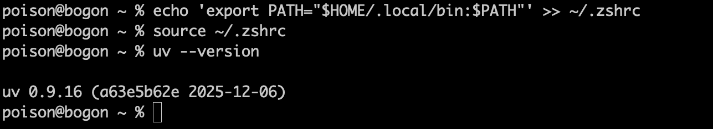
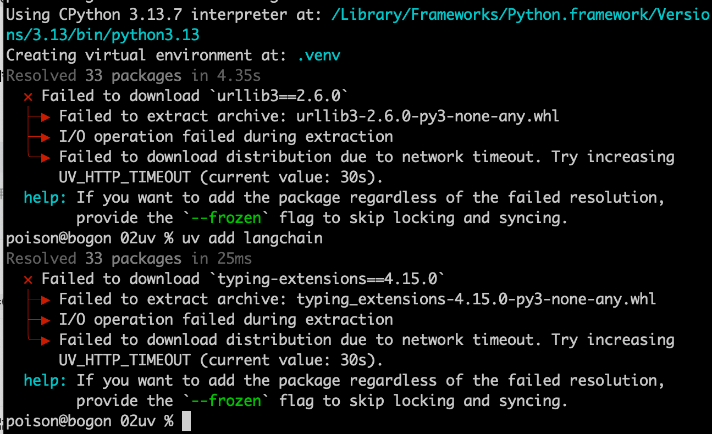

安装：

# Linux/macOS

```bash
curl -LsSf https://astral.sh/uv/install.sh | sh
```

# Windows（PowerShell）

```
powershell -c "irm https://astral.sh/uv/install.ps1 | iex"
```


mac下安装完以后会提示导出系统环境变量：

```
curl -LsSf https://astral.sh/uv/install.sh | sh downloading uv 0.9.16 aarch64-apple-darwin no checksums to verify installing to /Users/poison/.local/bin  uv  uvx everything's installed! To add $HOME/.local/bin to your PATH, either restart your shell or run:     source $HOME/.local/bin/env (sh, bash, zsh)    source $HOME/.local/bin/env.fish (fish)
```


安装好以后，大家用ai查询对应操作：

下面是mac下的操作

# 编辑 zsh 配置文件，导出环境变量到Path,目的是让uv全局命令行下可用：

```bash
echo 'export PATH="$HOME/.local/bin:$PATH"' >> ~/.zshrc
```


# 立即加载配置（无需重启终端）

```
source ~/.zshrc
```

验证uv全局可用，打印版本号：

```bash
uv --version
```



#直接在一个python项目目录下直接在终端执行：

uv add 加上包名，会自动下载相关包所以来的包：

例如安装langchain,会自动安装虚拟环境，并且在里面安装包，但是有的时候会下载失败

```
uv add langchain
```

下图为：直接安装后下载失败：



设置清华镜像源：

下面是临时的

```bash
# macOS/Linux
export UV_INDEX_URL=https://pypi.tuna.tsinghua.edu.cn/simple

# Windows (PowerShell)
$env:UV_INDEX_URL = "https://pypi.tuna.tsinghua.edu.cn/simple"
```


可以在环境变量path的 UV_INDEX_URL，mac操作如下：

终端输入：

```
open ~/.zshrc
```

然后添加：

```
export UV_INDEX_URL=https://pypi.tuna.tsinghua.edu.cn/simple
```

激活~/.zshrc

```
source ~/.zshrc
```


```
export UV_INDEX_URL=https://pypi.tuna.tsinghua.edu.cn/simple
```


