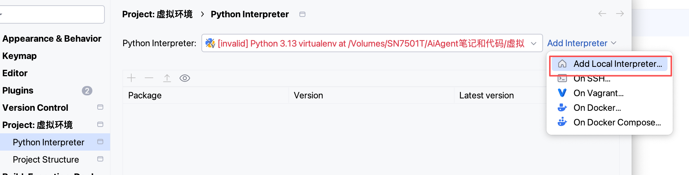
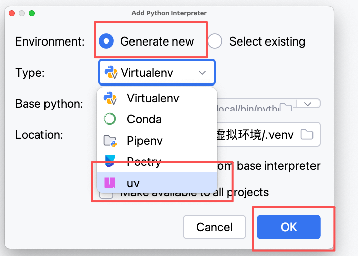
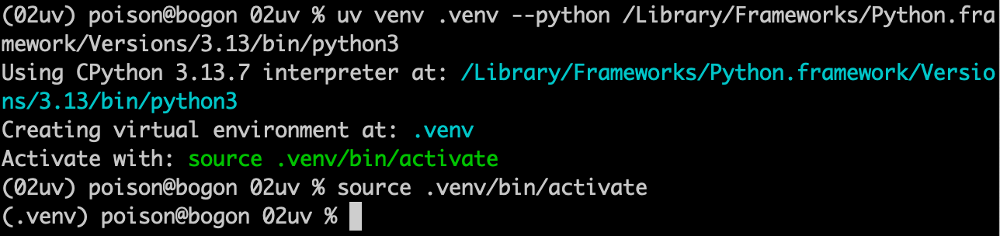
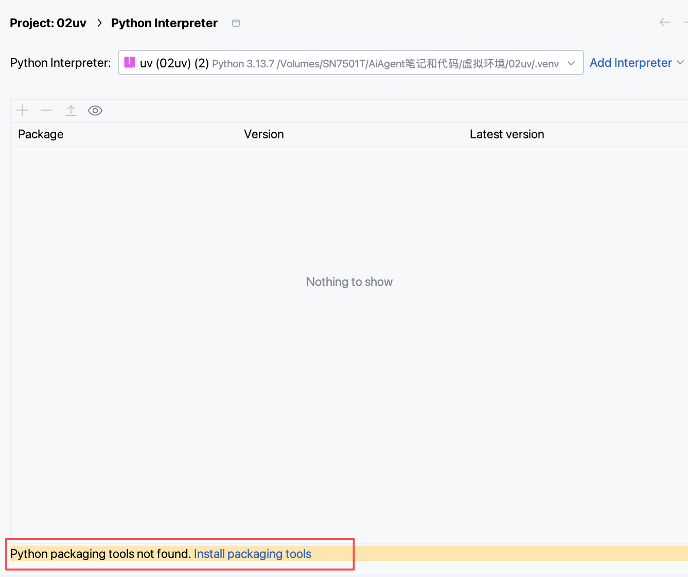
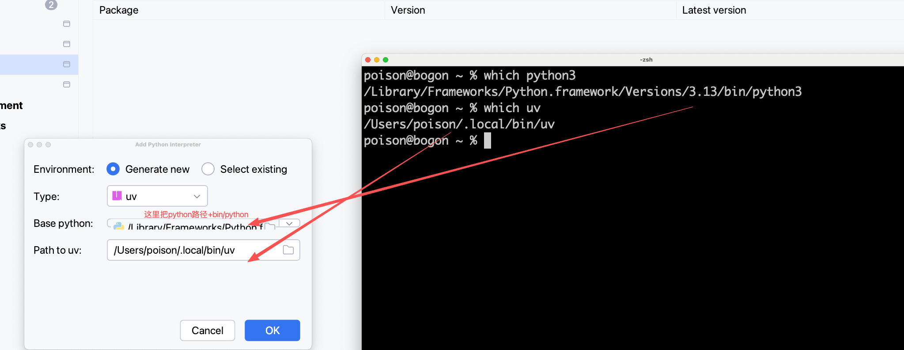
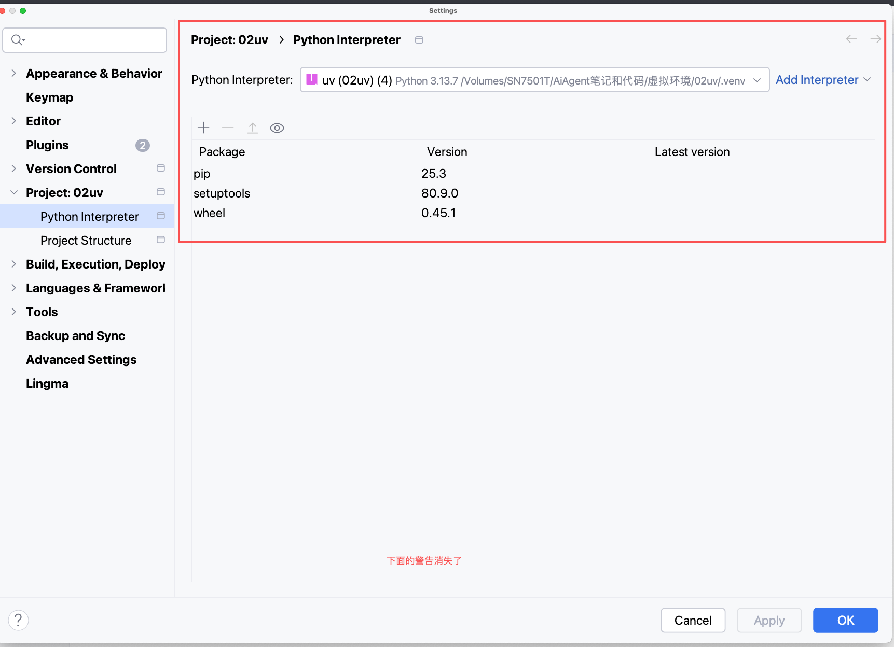
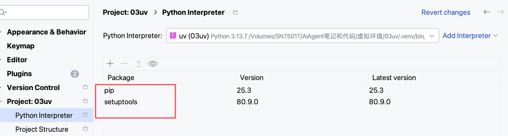

pycharm里面新建uv虚拟环境：

### 

### 

注意，pycharm创建uv虚拟环境的时候项目目录名字要合法，不能是中文，否则运行报错，例如下面项目目录名是中文：虚拟环境报错如下，提示当前目录 “虚拟环境”不是一个有效的包名，请提供一个包名 用--name：

```
command:   error: The current directory (`虚拟环境`) is not a valid package name. Please provide a package name with `--name`.
```


手动命令行创建uv虚拟环境

首先查询：python3的目录：

```
which python3
```

例如得到目录如下：

```
which python3
/Library/Frameworks/Python.framework/Versions/3.13/bin/python3
```

我们把下面的目录当做创建虚拟环境的python的路径


使用uv创建虚拟环境命令如下：

Uv venv --python 加which python打印的路径名


```bash
uv venv 虚拟环境名 --python python的系统路径名
```

```
uv venv .venv --python /Library/Frameworks/Python.framework/Versions/3.13/bin/python3
```

激活虚拟环境：


```
source activate
```

如下图：创建并且激活：



打开虚拟环境下的文件pyvenv.cfg文件如下：

```
home = /Library/Frameworks/Python.framework/Versions/3.13/bin
#原始 Python 解释器所在目录

implementation = CPython
	#虚拟环境使用的 Python 解释器实现类型是CPython
uv = 0.9.16
#uv版本号

version_info = 3.13.7
#虚拟环境python版本

include-system-site-packages = false
#false是不使用系统的python包，意思是，当前虚拟环境是否包含系统的包，=false是不包含，当前虚拟环境只使用自己安装的包

prompt = 02uv
#拟环境激活后，终端前缀显示的「环境名称」
```


激活虚拟环境和退出虚拟环境跟venv和virtualenv完全一样

```bash
# 退出当前虚拟环境
deactivate

# 重新激活（Mac/Linux）
source .venv/bin/activate
```

uv创建的虚拟环境默认没有安装打包工具，再pycharm提示如下图：

Python packaging tools not found. Install packaging tools




点击安装没效果，可以在命令行里面激活虚拟环境之后再安装：

uv的安装指令是：uv pip install 加包名

安装setuptools， wheel ,pip 3个工具

uv pip install是 把pip install 的命令兼容过来

```bash
uv pip install  setuptools wheel pip
```

### 

注意用pycharm创建uv虚拟环境的时候 项目名不能是中文


### 


mac下uv的安装包是：

uv pip install

windows下同学，可能没有pip


激活虚拟环境原理：

在sys.path里面遍历里面的目录，并且查找包

例如命令行执行：

```
python3
```

成功以后执行：

导入sys和pprint美观打印，把pprint 改名为pp，为了少打点字母

执行pp.pp(sys.path)，激活虚拟环境以后会多一个

```
import sys,pprint as pp
```

```
pp.pp(sys.path)
```


```
 '/Volumes/SN7501T/AiAgent笔记和代码/虚拟环境/02uv/.venv/lib/python3.13/site-packages']
```


```

['',
 '/Library/Frameworks/Python.framework/Versions/3.13/lib/python313.zip',
 '/Library/Frameworks/Python.framework/Versions/3.13/lib/python3.13',
 '/Library/Frameworks/Python.framework/Versions/3.13/lib/python3.13/lib-dynload',
 '/Volumes/SN7501T/AiAgent笔记和代码/虚拟环境/02uv/.venv/lib/python3.13/site-packages']
```


# pyproject.toml 项目依赖文件

当我们执行了uv add langchain，以后，这个文件里面的依赖文件dependencies只有一个langchain

```
name = "02uv"

version = "0.1.0"

description = "Add your description here"

readme = "README.md"

requires-python = ">=3.13"

dependencies = [

  "langchain>=1.1.2",

]
```

这个配置文件需要uv init来创建

使用这个命令在python项目目录创建，自动安装2个工具：

```
uv init
```




在项目目录下没激活虚拟环境但是可以使用uv pip list指令查看安装了什么包

```
uv pip list
```

Package    Version
---------- -------
pip        25.3
setuptools 80.9.0