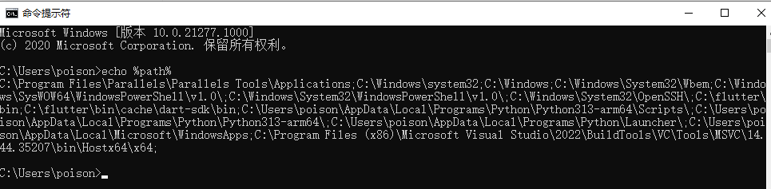
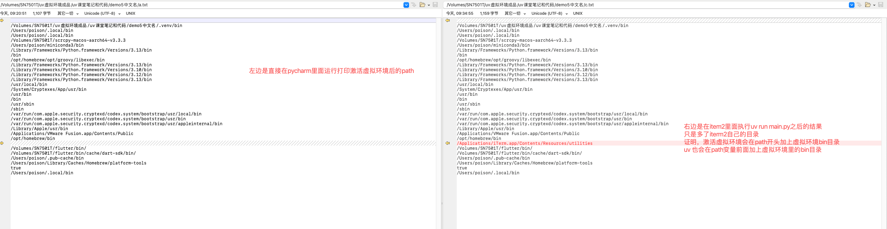

Mac在没激活虚拟环境的时候在终端下执行：

```
echo $path
```

echo是mac下输出的命令 $代表 path是变量

echo $path代表打印出 path变量的值


windows同学，可以在cmd命令提示符中使用echo %path% 来打印path变量,注意powershell语法不一样

```
echo %path%
```







激活虚拟环境以后path最前面会有虚拟环境的目录，python pip 等指令会从path最前面找可执行文件，找到就马上执行，不向后找。不会执行后面系统的python可执行程序，实现环境隔离，如果都没找到可执行程序，会报错：command not found

有时候pcharm选择错误虚拟环境会提示。有时候选择完虚拟环境，要等一会，或者重启以后才能找到，pycharm选择虚拟环境时，尽量不要用字母数字之外的符号当做项目名

uv run 执行的时候发现path开头也有虚拟环境的路径，里面有可执行程序。

python打印path

```python
import os

path_original = os.getenv("PATH")
# print(path_original)
# print(f"{os.pathsep}")#当前平台路径分隔符是

list1 = path_original.split(os.pathsep)
for item in list1:
    print( item)
```
